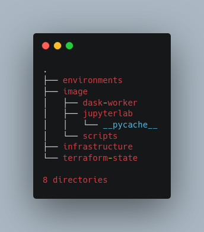
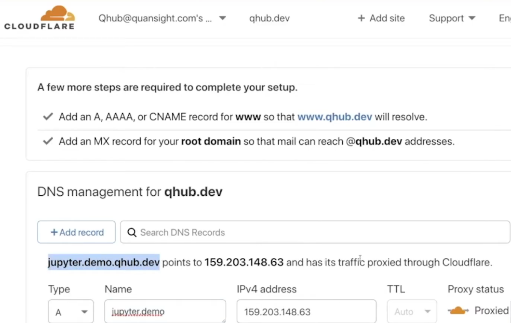

# QHub
Automated data science platform. From JupyterHub to Cloud environments.

[](https://badge.fury.io/py/qhub)

QHub is an open source tool that enables users to build and maintain
cost-effective and scalable compute/data science platforms [on-premises](#on-premises) or on [cloud providers](#cloud-providers).
with minimal DevOps experience.

## On-Premises
QHub On-Prem is based on OpenHPC.
> NOTE: This section of the docs is under development.

## Cloud providers
QHub offers out-of-the-box support for [Digital Ocean], Amazon [AWS] and [GCP] (Google Cloud Provider). Although by 
default, as long as the chosen provider offers Kubernetes services and has a Terraform module, it is possible to 
configure QHub to deploy your project.


For more details, check out the release [blog post](https://www.quansight.com/post/announcing-qhub).

## Usage
### Installation pre-requisites
* QHub is supported by macOS and Linux operating systems (Windows is **NOT** currently supported);
* We recommend the adoption of virtual environments (`conda`, `pipenv` or `venv`) for successful usage. 

### Install
QHub's installation can be performed by using:
* `conda`:
  ```bash
  conda install -c conda-forge qhub
  ```
  
* or `pip` (instead):
    ```bash
    pip install qhub
    ```  
Once finished, you can check QHub's version (and additional CLI args) by typing:
```bash
qhub --help
```
If successful, the CLI output will be similar to the following:


### Set up initialization
#### 1. Cloud Provider
The first required step is to **choose a Cloud Provider to host the project deployment**. The cloud installation is based
on Kubernetes, but knowledge of Kubernetes is **NOT** required. By default, QHub uses DigitalOcean, AWS and GCP. If you 
wish to use a different provider, make sure they support Kubernetes and Terraform and follow the suitable documentation
to configure it.

#### 2. Authentication (using OAuth and GitHub)
In order to use GitHub actions, QHub will request a `client_id` and `client_secret`. To create those, you will need to 
sign up for a [GitHub Developer account](https://github.com/settings/developers) and follow the steps in the Auth0 page
on [how to Connect Apps to GitHub](https://auth0.com/docs/connections/social/github#set-up-app-in-github). Take note of
your GitHub `client_id` and `client_secret`.

#### 3. Domain
Finally, you will need to have a domain name for hosting QHub. The [docs](https://qhub.dev/docs/step-by-step-walkthrough.html#cloudflare),
describe how register DNS using Cloudflare only, but any other DNS provider can be used.

Once all those have been set, it is time to generate the config file.

### Initialize Configuration
Configuration files can be created with the command `qhub init` from the source folder, followed by the alias of the
chosen Cloud provider, such as:
```
    qhub init do        # for DigitalOcean 
```
```bash
    qhub init aws       # for AWS cloud provider
```
```bash
    qhub init gcp       # for Google Cloud Provider 
```

The command will prompt for a `project name` and a `domain name`. Once typed, it will output instructions on how to 
create an OAuth app on GitHub, and finally ask for the GitHub `client_id` and `client_secret` of the just app created.

The CLI steps as illustrated on the image below:


This will generate the `qhub-config.yaml` configuration file with the project's general information, and settings for 
security, infrastructure, computational resource profiles and virtual environments. Triggered by [Github Actions], this
YAML file will set up the automated deployment and handle the scaling of the data science project.

For more details on how to modify the configuration file, check out the [docs](https://qhub.dev/docs/do/configuration.html).

> NOTE: To verify if Terraform is installed on your virtual env type `terraform` on your terminal window. In case 
> it is necessary to install it (using conda) type:
> ```
> conda install -c conda-forge terraform=0.13
>```
> Terraform version 0.14 is not currently supported. 

### Render the configuration file
After the [initialization](#-initialize-configuration), we will need to render the config file to create the Terraform
configuration module. The command below will do so and create folders to hold the deployment states.

```bash
qhub render -c qhub-config.yaml -o . --force
```

The local folder will now look like the image below:



### Deploy the project
Finally, the project can be deployed with:
```bash
  qhub deploy -c qhub-config.yaml --dns-provider cloudflare --dns-auto-provision
```

The command will check the environment variables and initialize and apply Terraform modules. The process can take up 
to 20 minutes.

When finished, part of the output will be an `ip` address (DO/GCP) or a CNAME `hostname` (AWS), such as illustrated below:
```bash
DigitalOcean/GCP:
    Outputs:

    ingress_jupyter = {
    "hostname" = ""
    "ip" = "xxx.xxx.xxx.xxx"
    }

AWS:       
    Outputs:

    ingress_jupyter = {
    "hostname" = "xxxxxxxxxxxxxxxxxxxxxxxxxxxxxxxx-xxxxxxxxxx.us-east-1.elb.amazonaws.com"
    "ip" = ""
    }
```

You will then need to update the name and content of the datafile at the DNS management page. In the example below, the
DNS used is Cloudflare but any other DNS provider can be used.


This step will allow QHub to be accessed by typing the URL registered under `Name` on an address bar. In this case,
the link is [jupyter.demo.qhub.dev].

### Version Control
Add files to GitHub:
* `git init` on the local folder
* `git add .`
* `git commit -m 'Initial_commit'`
* Open a new repository on GItHub with the same name as the local folder
* Copy the command `git remote add origin <repo_name>.git` and paste it on the terminal.
* Finally, `git push` will add all the infrastructure files to the specified repository.

Once the files have been pushed, all CI/CD changes will be done via [GitHub Actions] and triggered by committing it 
to master through Pull Requests (PRs). Once a PR is merged, it will trigger a deployment of all the changes made
to the QHub deployment.

### Destroy the project
To remove all infrastructure for QHub, use the command below:

```bash
 qhub destroy -c qhub-config.yaml
```
After deletion, it is possible to recreate the previous infrastructure by running the [deploy command](#deploy-the-project)
using the same configuration file.


## Developer
To install the latest developer version use:
```bash
pip install git+https://github.com/Quansight/qhub.git
```


## Contributions

Thinking about contributing? Check out our [Contribution Guidelines](https://github.com/Quansight/qhub/CONTRIBUTING.md).

## License

[QHub is BSD3 licensed](LICENSE).


[jupyterhub]: https://jupyter.org/hub "A multi-user version of the notebook designed for companies, classrooms and research labs"
[dask]: https://docs.dask.org/ "Dask is a flexible library for parallel computing in Python."
[kubernetes]: https://kubernetes.io/ "Automated container deployment, scaling, and management"
[qhub]: https://qhub.dev/ "Official QHub documentation"
[qhub]: https://qhub.dev/ "Official QHub documentation"
[Github Actions]: https://github.com/features/actions
[Digital Ocean]: https://www.digitalocean.com/ "Digital Ocean website"
[AWS]: https://aws.amazon.com/ "Amazon Web Services (AWS) website"
[GCP]: https://cloud.google.com/ "Google Cloud Provider website"
[qhub gh]: https://github.com/Quansight/qhub "QHub GitHub page"
