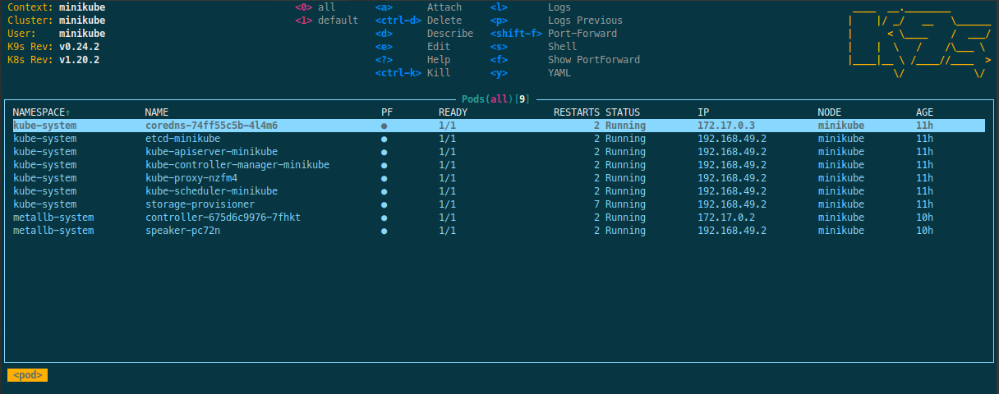

# Troubleshooting and further setup
This guide aims to provide useful information to developers in the detection and correction of issues within QHub.

## General Troubleshooting
To minimize the occurrence of errors on your QHub application, please follow the best practices described on the
[Installation](01_installation.md), [Setup](02_setup.md) and [Usage](03_usage.md) sections.

### Solutions for common problems
#### Downgrade an installed Terraform version

QHub is currently ONLY compatible with Terraform version 0.13.5. To check your installed version on terminal type `terrafrom -v`.
If your local version is more recent than the recommended, follow these steps:
On terminal type `which terraform` to find out where the binary installation file is located.
The output will be a filepath, such as: `/usr/bin/terraform`
Then, remove the binary file with:
```shell
rm -r /usr/bin/terraform
```
> `/usr/bin/terraform` corresponds to the location of the installed binary file.

Next, download the binary for the compatible version with:
```shell
wget https://releases.hashicorp.com/terraform/0.13.5/
```
Unzip the file, and move it to the same location as the previous one:
```shell
unzip terraform_0.13.5
mv ~/Downloads/terraform /usr/bin/
```
Finally, check if the correct version was installed with `terraform -v`, the output should be `Terraform v0.13.5`.

---

#### Debug your Kubernetes cluster

 [K9s](https://k9scli.io/) is a terminal-based UI to manage Kubernetes clusters that aims to
 simplify navigating, observing, and managing your applications in K8s.
 K9s continuously monitors Kubernetes clusters for changes and provides
 shortcut commands to interact with the observed resources becoming a
 fast way to review and resolve day-to-day issues in Kubernetes. It's
 definitely a huge improvement to the general workflow, and a best-to-have
 tool for debugging your Kubernetes cluster sessions.

Installation can be done on macOS, Windows, and Linux. Instructions
for each operating system can be found [here](https://github.com/derailed/k9s).
Complete the qinstallation to follow along.

By default, K9s starts with the standard directory that is set as the
context (in this case Minikube). To view all the current process press `0`:



> **NOTE**: In some circumstances you will be confronted with the
  need to inspect any services launched by your cluster at your ‘localhost’. For instance, if your cluster has problem
with the network traffic tunnel configuration, it may limit or block the user's
  access to destination resources over the connection.

K9s port-forward option <kbd>shift</kbd> + <kbd>f</kbd> allows you to access and interact
with internal Kubernetes cluster processes from your localhost you can
then use this method to investigate issues and adjust your services
locally without the need to expose them beforehand.

---

## Further Setup
### Theming
#### JupyterHub Theme

The QHub theme was originally based off the [work of the pangeo
team](https://github.com/pangeo-data/pangeo-custom-jupyterhub-templates)
and is now located in
[github.com/Quansight/qhub-jupyterhub-theme](https://github.com/Quansight/qhub-jupyterhub-theme/). For
simple modifications to the jupyterhub theme we suggest only editing
`infrastructure/jupyterhub.yaml` and the value
`c.JupyterHub.template_vars`. For most use cases this should provide
enough flexibility.

```yaml
hub:
  extraConfig:
    customPodHook: |
      c.JupyterHub.template_paths = ['/usr/local/share/jupyterhub/custom_templates/']
      c.JupyterHub.template_vars = {
          'pangeo_hub_title': 'QHub - $do-jupyterhub',
          'pangeo_hub_subtitle': 'Autoscaling Compute Environment on Digital Ocean',
          'pangeo_welcome': """Welcome to $. It is maintained by the <a href="http://quansight.com">Quansight staff</a>. The hub's configuration is stored in the github repository based on <a href="https://github.com/Quansight/qhub-kubernetes/">https://github.com/Quansight/qhub-kubernetes/</a>. To provide feedback and report any technical problems, please use the <a href="https://github.com/Quansight/qhub-kubernetes//issues">github issue tracker</a>."""
      }
```

For more serious modifications to the jupyterhub theme you will need
to fork
[Quansight/qhub-jupyterhub-theme](https://github.com/Quansight/qhub-jupyterhub-theme)
and edit the jupyterhub Dockerfile located at
`image/Dockerfile.jupyterhub`. Modify the `THEME_OWNER`, `THEME_REPO`,
and `THEME_REV`. This should change the Dockerfile to use your new
theme. The
[Quansight/qhub-jupyterhub-theme](https://github.com/Quansight/qhub-jupyterhub-theme)
has detailed documentation.

#### JupyterLab Theme

Setting the JupyterLab theme is done via extensions. Edit the
`image/postBuild` script to include the jupyterlab extension in the
build. Within the `image` directory run the following to build
jupyterlab.

```shell
docker build -f Docker.jupyterlab -t Quansight/qhub-jupyterlab:latest .
```

Finally, you can test the resulting image via the following docker
command and open your web browser to `localhost:8000`.

```shell
docker run -p 8000:8000 -it Quansight/qhub-jupyterlab:latest jupyter lab --port 8000 --ip 0.0.0.0
```
---

### Useful Kubernetes commands

---

### Integrations
#### Prefect
TODO
#### Bodo
TODO
