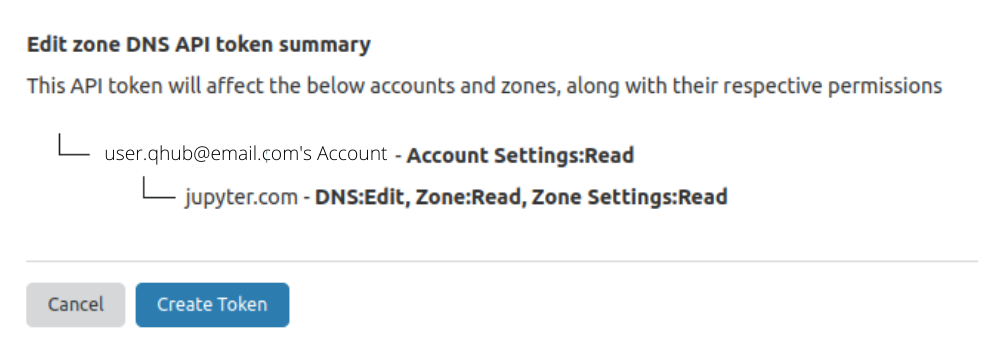

# Setup Initialization

QHub Cloud offers two usage options: [local](#local-deployment) and [Cloud](#cloud-deployment) deployment.
We advise newcomers to start with local deployment and once their initial setup is tested, move on to the Cloud option.

## Local Deployment
The local version is recommended for testing QHub's components due to its simplicity. It is important to highlight that 
while it is possible to test most of QHub with this version, components which are Cloud provisioned such as, 
VPCs, managed Kubernetes cluster, and managed container registries cannot be locally tested due to their Cloud dependencies.

TODO: explain in more detail which parts can be tested by the local deployment. And which QHub components cannot be.  

### Dependencies
To deploy QHub locally requires the installation of the following dependencies:
+ [Minukube](https://v1-18.docs.kubernetes.io/docs/tasks/tools/install-minikube/) version 1.10.0-beta and up
+ [Docker](https://docs.docker.com/engine/install/) install.
  
The installation of a hypervisor is **not** necessary.

> NOTE: Minikube requires `kubectl`. To install `kubectl`, 
> [follow the instructions](https://v1-18.docs.kubernetes.io/docs/tasks/tools/install-kubectl/) according to your operating system.

### Initialize Kubernetes cluster

The following command will initialise a cluster using Minikube with 2 CPUs and 4Gb of RAM, where Docker is the chosen driver.

```bash
minikube start --cpus 2 --memory 4096 --driver=docker
```
If successful, the command above should output the following on your terminal:
```bash
...
🏄  Done! kubectl is now configured to use "minikube" cluster and "default" namespace by default
```

Next, we will install `nfs-common` drivers. This is required by the JupyterLab instances, which require NFS mount for 
`PersistentVolumeClaims` (PVCs). To install it, run:

```shell
minikube ssh "sudo apt update; sudo apt install nfs-common -y"
```
For more details on PVs and PVCs, read the [JupyterHub documentation](https://zero-to-jupyterhub.readthedocs.io/en/latest/jupyterhub/customizing/user-storage.html).

#### MetalLB

[MetalLB](https://metallb.universe.tf/) is the load balancer for bare metal Kubernetes clusters. We will need to configure
MetalLB to match the QHub configuration. 
To configure `metallb` run:

```shell
minikube addons configure metallb
```
Since Minikube does not provide a simple interactive way to configure addons, 
([as shown in this repository issue](https://github.com/kubernetes/minikube/issues/8283)). We will set up the configuration
directly. To do so, paste the bash script below on your terminal.

<details><summary>Click to expand</summary>

```bash
python <<EOF
import json
import os

filename = os.path.expanduser('~/.minikube/profiles/minikube/config.json')
with open(filename) as f:
     data = json.load(f)

data['KubernetesConfig']['LoadBalancerStartIP'] = '172.17.10.100'
data['KubernetesConfig']['LoadBalancerEndIP'] = '172.17.10.200'

with open(filename, 'w') as f:
     json.dump(data, f)
EOF
```
</details>

TODO: test the docs on macOS and check if this installation of MetalLB works. 

If successful, the output will be similar to
```shell
✅  metallb was successfully configured
```
Lastly, enable MetalLB by running
```bash
minikube addons enable metallb
```
To which the output should be:
```
  The 'metallb' addon is enabled
```
---

## Cloud Deployment
The Cloud version of QHub requires a choice of [Cloud provider](#cloud-provider), 
[authentication(using Auth0 and GitHub)](#authentication), [domain registration](#domain-registry), and GitHub Actions tokens.

Those services will generate global [environment variables](https://linuxize.com/post/how-to-set-and-list-environment-variables-in-linux/)
that once set up will trigger QHub's automatic deploy using GitHub Actions.


To find and set the environment variables, follow the steps described on the subsections below.

### Cloud Provider
The first required step is to **choose a Cloud Provider to host the project deployment**. The cloud installation is based
on Kubernetes, but knowledge of Kubernetes is **NOT** required. QHub supports [DigitalOcean](https://www.digitalocean.com/),
[Amazon AWS](https://aws.amazon.com/), [GCP](https://cloud.google.com/), and [Azure](https://azure.microsoft.com/en-gb/).

All access keys require fairly wide permissions in order to be used by QHub. Hence, we recommend setting all variables
with owner/admin level permissions.

For specific details on how to set up QHub for each Cloud provider, check the How-To Guides section of the docs.


### Authentication
#### Auth0
To create the necessary access tokens you will need to have an [Auth0](https://auth0.com/) account and be logged in.
- Click on the `Applications` button on the left
- Select `Create Application` > `Machine to Machine Applications` > `Auth0 Management API` from the dropdown menu
- Next, click `All` next to `Select all` and click `Authorize`
  - Set the variable `AUTH0_CLIENT_ID` equal to the `Cliend ID` string, and do the same for the `Client secret` by running the command below.
  
```shell
export AUTH0_CLIENT_ID="secretClientID"
export AUTH0_CLIENT_SECRET="verylongstringofcharactersthatrepresentthesecretkey"
```
Finally, set the `AUTH0_DOMAIN` variable to your account name (indicated on the upper righthand corner) appended with 
`.auth0.com`, for example:
```shell
export AUTH_DOMAIN="qhub-test.auth0.com" # in case the account was called 'qhub-test'
```

#### GitHub 
QHub uses GitHub Actions to trigger the CI/CD checks on the configuration file that automatically generates
the Terraform modules for the deployment infrastructure. To do that, it will be necessary to set the GitHub username and
token to the environment variables.
```shell
export GITHUB_USERNAME="quansight"
export GITHUB_TOKEN="GitHubAccessTokenGenerated"
```
### Domain registry
Finally, you will need to have a domain name for hosting QHub. This domain will be where your application will be exposed.

Currently, QHub only supports CloudFlare for automatic DNS registration. if an alternate DNS provider is desired, 
change the `--dns-provider` flag from `cloudflare` to `none` on the `qhub deploy` command. The deployment then will be 
paused when it has an IP address (or CNAME, if using AWS) and prompt to register the desired URL.

#### CloudFlare
First, create a Cloudflare account and register your application domain name on it.

To generate a token:
- Under `Profile`, select the `API Tokens` menu and click on `Create API Token`.
- On `Edit zone DNS` click on `Use Template`.

- Configure `Permissions` such as the image below:

- On `Account Resources` set the configuration to include your desired account
  
- On `Zone Resources` set it to `Include | Specific zone` and your domain name

- Click continue to summary
  
- Click on the `Create Token` button and set the token generated as an environment variable on your machine.
```shell
export CLOUDFLARE_TOKEN="cloudflaretokenforthisapplication"

```

Now we are all set!

On the next section, we will generate the main configuration file.
